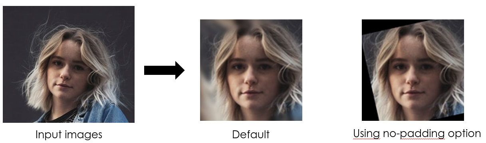
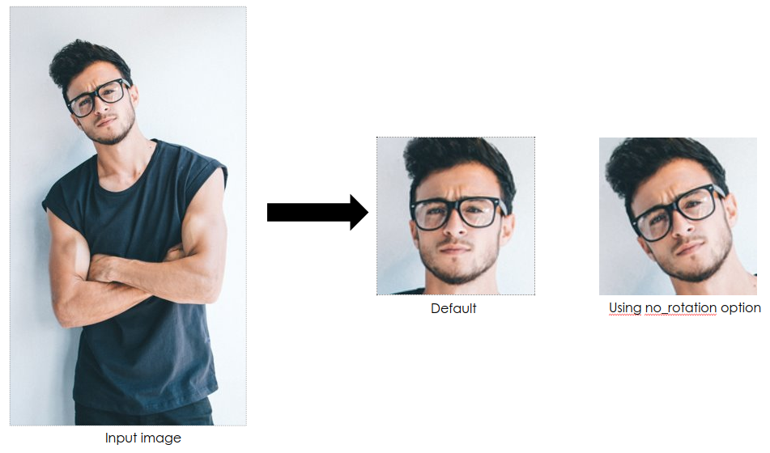

# FFHQ-alignement-generic
Using FFHQ alignement initial method using mediapipe or dlib as landmarks detection method.

### 1. Usage
Launch the following script:
```
python generate_image.py
```


### 2. Script options

* --InFolder: directory to input images to align
* --OutFolder: directory where to place generates align images
* --method: landmark library. So far, supported are 'mediapipe' and 'dlib'
* --no_padding: Do not us padding.



* --rotate_level. Do not rotate face.



* * --size_output. Image output size. Default is 1024


Script is able to manage multi faces in a single image.


### 3. Photo credits


