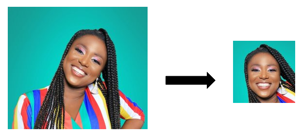

# FFHQ-alignement-generic
Using FFHQ alignement method with [mediapipe](https://google.github.io/mediapipe/solutions/face_mesh.html) (or [dlib](http://dlib.net/face_landmark_detection.py.html)) as landmarks detection method.


### 1. Usage
Launch the following script:
```
python generate_image.py
```



### 2. Script options

* --InFolder: directory to input images to align
* --OutFolder: directory where to place generates align images
* --method: landmark library. So far, supported are 'mediapipe' and 'dlib'
* --no_padding: Do not us padding.


* --rotate_level. Do not rotate face.


* * --size_output. Image output size. Default is 1024


Script is able to manage multi faces in a single image.


### 2. Algorithm explanation
Excellent stuff from this [paper](https://arxiv.org/abs/2109.09378)


@articleFreeStyleGAN2021, author = Thomas Leimkühler and George Drettakis, title = FreeStyleGAN: Free-view Editable Portrait Rendering with the
Camera Manifold, booktitle = ACM Transactions on Graphics (SIGGRAPH Asia), publisher = ACM, volume = 40, number = 6, year = 2021, doi = 10.1145/3478513.3480538


### 3. Photo credits
* Photo by <a href="https://unsplash.com/@batelstudios?utm_source=unsplash&utm_medium=referral&utm_content=creditCopyText">Batel Studio</a> on <a href="https://unsplash.com/@batelstudios?utm_source=unsplash&utm_medium=referral&utm_content=creditCopyText">Unsplash</a>

* Photo by <a href="https://unsplash.com/@mehdizadeh?utm_source=unsplash&utm_medium=referral&utm_content=creditCopyText">Mubariz Mehdizadeh</a> on <a href="https://unsplash.com/?utm_source=unsplash&utm_medium=referral&utm_content=creditCopyText">Unsplash</a>

* Photo by <a href="https://unsplash.com/@mafonso?utm_source=unsplash&utm_medium=referral&utm_content=creditCopyText">Michael Afonso</a> on <a href="https://unsplash.com/?utm_source=unsplash&utm_medium=referral&utm_content=creditCopyText">Unsplash</a>

* Photo by <a href="https://unsplash.com/@thoughtcatalog?utm_source=unsplash&utm_medium=referral&utm_content=creditCopyText">Thought Catalog</a> on <a href="https://unsplash.com/?utm_source=unsplash&utm_medium=referral&utm_content=creditCopyText">Unsplash</a>
  
  

  


